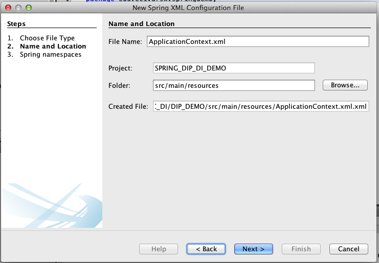

# Escuela Colombiana de Ingeniería
# Arquitecturas de Software - ARSW
### Taller – Principio de Inversión de dependencias, Contenedores Livianos e Inyección de dependencias.

Parte I. Ejercicio básico.

Para ilustrar el uso del framework Spring, y el ambiente de desarrollo para el uso del mismo a través de Maven (y NetBeans), se hará la configuración de una aplicación de análisis de textos, que hace uso de un verificador gramatical que requiere de un corrector ortográfico. A dicho verificador gramatical se le inyectará, en tiempo de ejecución, el corrector ortográfico que se requiera (por ahora, hay dos disponibles: inglés y español).

1. Abra el los fuentes del proyecto en NetBeans.
2. Para el proyecto suministrado, cree un nuevo archivo de configuración de Contextos para Spring, el cual, por convención, se llamará applicationContext.xml:

	
 
3. Rectifique que el archivo de configuración quede en la ruta estándar de Maven para archivos de configuración (/src/main/resources):

	


4.	Para este ejemplo, realice la siguiente configuración de Spring (use las opciones de autocompletar (ctrl+espacio) del IDE NetBeans:

	* Se tendrá un bean llamado 'schecker' (spellChecker), el cual -por ahora- estará asociado a la clase SpanishSpellChecker.
	* Se tendrá un bean 'grammarChecker' asociado a la clase GrammarChecker.
	* El bean GrammarChecker tiene una propiedad 'spellChecker' (dado que tiene unos métodos getSpellChecker/setSpellChecker). En dicha propiedad se inyectará (cuando se construya una instancia de spellChecker) el bean 'schecker' definido anteriormente.


	
 
 
5.	Haga un programa de prueba, donde se cree una instancia de GrammarChecker mediante Spring, y se haga uso de la misma:

	```java
	public static void main(String[] args) {
		ApplicationContext ac=new ClassPathXmlApplicationContext("applicationContext.xml");
		GrammarChecker gc=ac.getBean(GrammarChecker.class);
		System.out.println(gc.check("la la la "));
	}
	```
	
6.	Modifique el archivo de configuración de Spring para que el Bean ‘spellChecker‘ ahora haga uso de la clase SpanishSpellChecker (para que a GrammarChecker se le inyecte EnglishSpellChecker en lugar de  SpanishSpellChecker. Verifique el nuevo resultado.


